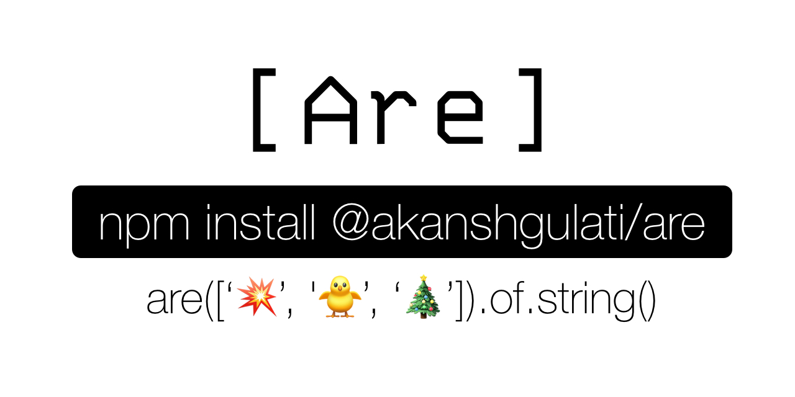

<p>
    <h1 hidden>Are</h1>
</p>
<p align="center">
    
</p>
<p align="center">
    A type checking utility for element(s) of an Array based on <strong>chaining</strong> flow to combine multiple operations.
</p>
 
<p align="center">
    
    
    <a href="https://twitter.com/akanshgulati">
        
    </a>

</p>

<hr/>

<br>

## 🚀 Installation  
  
NPM  
```shell  
$ npm install @akanshgulati/are  
```  
  
YARN  
```shell  
$ yarn add @akanshgulati/are  
```

<br>

## 🎉 Usage   
```js  
const Are = require('@akanshgulati/are');  
  
Are([1,2,3,4]).of.number();  
//=> true  
  
Are(["🎉","🎁","🔆" ]).of.type('string');  
//=> true'  
  
Are(["a", "b", "c"]).of.not.type('string');  
//=> false  
  
Are([[[[[[[[[1]]]]]]]]]).flat.of.number();  
//=> true  
```    

<br>

##  📙 API  

### Helpers
Helps in selected a particular set of an array and negative of the current type-check
```  
.all - checks for all elements (default)  
.any - checks for all elements of array  
.first - check for first element  
.last - check for last element  
.middle - check for middle element(s)
.flat - check for type in flatten array
.not - checks for opposite, e.g. (.not.any => .all)  
```  

### Types 

#### .type(\<value>)
The value needs to be in Pascal case (e.g. NaturalNumbers) or Underscore separated (e.g. natural_number)

**Primitive types**
```
String
Number
Object
Array
Boolean
Date
ArrayBuffer
```

**Array types**
```
Int8Array
Uint8Array  
Uint8ClampedArray  
Int16Array  
Uint16Array  
Int32Array  
Uint32Array  
Float32Array  
Float64Array  
BigInt64Array  
BigUint64Array  
ArrayBuffer  
SharedArrayBuffer  
DataView
```
**Number types**
```
Integer  
SafeInteger  
Decimal  
Float  
Finite  
Infinite  
NaturalNumber  
WholeNumber  
PositiveNumber  
NegativeNumber  
Zero  
```

**Boolean types**
```
Falsy  
Truthy
```

### Built-in methods

#### .string()  
#### .number()  
#### .array()  
#### .boolean()  
#### .null()  
#### .undefined()  
#### .date()  
#### .int8Array()  
#### .uint8Array()  
#### .uint8ClampedArray()  
#### .int16Array()  
#### .uint16Array()  
#### .int32Array()  
#### .uint32Array()  
#### .float32Array()  
#### .float64Array()  
#### .bigInt64Array()  
#### .bigUint64Array()  
#### .dateView()  
#### .arrayBuffer()  
#### .sharedArrayBuffer()  
#### .integer()  
#### .safeInteger()  
#### .finite()  
#### .infinite()  
#### .wholeNumber()  
#### .positiveNumber()  
#### .negativeNumber()  
#### .zero()  
#### .decimal()  
#### .float()  
#### .truthy()  
#### .falsy()
  
  
### Check all elements (default)  
  
 - `Are(ARRAY).of.type(value)` // custom('string', 'number', 'object', 'boolean', 'array')  
 - `Are(ARRAY).of.number()` or `Are(ARRAY).of.number()` or `Are(ARRAY).all.of.number()`  
 - `Are(ARRAY).of.object()` or - `Are(ARRAY).of.object()` or - `Are(ARRAY).all.of.object()`  
 - `Are(ARRAY).of.string()` or - `Are(ARRAY).of.string()` or - `Are(ARRAY).all.of.string()`  
 - `Are(ARRAY).of.boolean()` or - `Are(ARRAY).of.boolean()` or - `Are(ARRAY).all.of.boolean()`  
  
### Check one element  
  
- `Are(ARRAY).any.of.type(value)` // custom('string', 'number', 'object', 'boolean', 'array')  
- `Are(ARRAY).any.of.number()`  
- `Are(ARRAY).any.of.object()`  
- `Are(ARRAY).any.of.string()`  
- `Are(ARRAY).any.of.boolean()`  
  
### Check at particular index  
  
- `Are(ARRAY).middle.of.type(value)` // checks for (n-1)/2 index in case of odd and (n-1)/2 and n/2 indexes in case even  
- `Are(ARRAY).first.of.type(value)` // checks for 0th index for type value  
- `Are(ARRAY).last.of.type(value)` // checks last element for type value  
- `Are(ARRAY).middle.of.not.type(value)` // returns true if `neither` of middle index(s) is of a type value  
- `Are(ARRAY).first.of.not.type(value)` // checks only for 0th index for `not` to be of type value  
  
  
### Check in nested array  
- `Are(ARRAY).flat.of.type(value)` // flatten array to same root and then checks for all elements for type value  
  
### Negation  
- `Are(ARRAY).of.not.type(value)` // checks if all the elements are of not type value  

<br>

## 🍺 Inspiration
No package available online which checks for an array of elements

1. It checks not only for a single element, instead, checks for an array of data
2. **Chaining** technique to add multiple operations in one go
3. **Performant** while type checking an array of elements.
4. Provides selection **helpers** for type checking a particular element of an array
5. Supports **negation** for checking opposite to current type checking.

<br>

## 🗜️ Examples 
You can refer to test file for various examples on above types, [see examples](https://github.com/akanshgulati/are/blob/57fce5c60e9ff226bc1edd48868c6d179167e661/test/index-test.js).

<br>

## 🔗 Related  
Currently there are multiple libraries which check for a single element but not for an array of elements.   
- [is](https://www.npmjs.com/package/is) - Package which checks single element  
- [expect](https://www.npmjs.com/package/expect.js) - Chaining of operations for testing assertions  
- [@sindresorhus/is](https://github.com/sindresorhus/is) - Advanced type checking of over 100 types.

<br>

## ✔️ To-do  
- [ ] Check for an empty array `isEmpty()`  
- [ ] Add support for TypeScript type gaurds  
- [x] More type checking like `.int16Array()`, `.float32Array()`  
- [x] Check for truthy elements if no element is undefined or null, `.isTruthy()`  
- [x] Check for integers, float values under type number, '`integers()`, `decimals()`  

<br>

## 👨‍💻 Maintainers  
- [Akansh Gulati](https://akansh.com)
